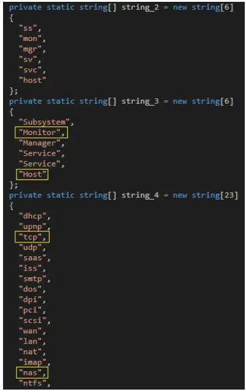
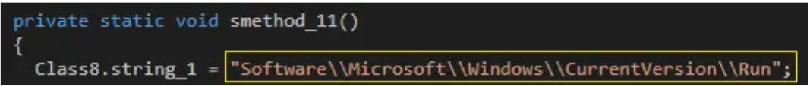
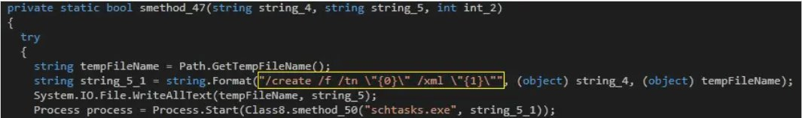
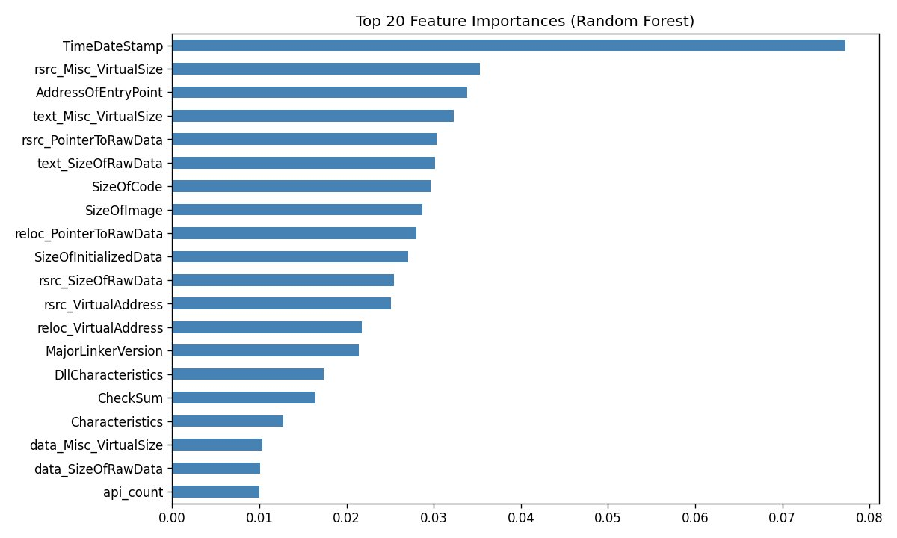
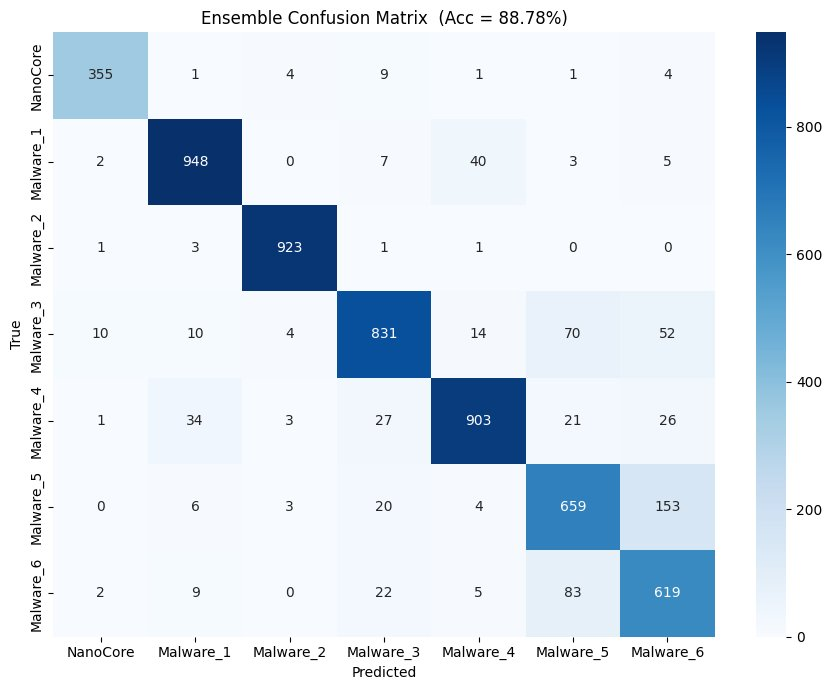

# 🔬 NanoCore RAT v1.2.2.0 — Malware Analysis

> **Full-stack malware analysis**: Static RE → Dynamic Analysis → ML Detection → LIME/SHAP Explainability

[](https://python.org)
[-lightgrey?logo=windows)](https://github.com/mandiant/flare-vm)
[](LICENSE)
[](streamlit_app/app.py)
[](detection/malware_classification.ipynb)

---

## 📋 Table of Contents

- [Overview](#overview)
- [Repository Structure](#repository-structure)
- [Part 1 — Reverse Engineering](#part-1--reverse-engineering)
- [Part 2 — ML Detection](#part-2--ml-detection)
- [Part 3 — Explainability (LIME & SHAP)](#part-3--explainability-lime--shap)
- [Streamlit Detection App](#streamlit-detection-app)
- [Key Findings](#key-findings)
- [MITRE ATT&CK Mapping](#mitre-attck-mapping)
- [Results](#results)
- [Setup & Usage](#setup--usage)
- [References](#references)

---

## Overview

This repository contains a complete malware analysis of **NanoCore RAT v1.2.2.0** — a commodity .NET C# Remote Access Trojan compiled on **Feb 22, 2015** that remains actively deployed.

The analysis covers three major tracks:

| Track | Tools | Key Outcome |
|-------|-------|-------------|
| **Reverse Engineering** | FLARE-VM · dnSpy · DIE · strings.exe | 6 obfuscation techniques documented; 138-combo persistence fingerprint reconstructed |
| **ML Detection** | scikit-learn · XGBoost · Kaggle dataset | 89.51% accuracy across 7 malware families; NanoCore precision 0.97 |
| **Explainability** | LIME · SHAP · Streamlit | Per-sample local explanations + global feature importance |

---

## Repository Structure

```
nanocore-rat-analysis/
│
├── README.md                          ← You are here
├── requirements.txt                   ← All Python dependencies
├── .gitignore
│
├── reversing/
│   ├── README_reversing.md            ← Detailed reversing methodology
│   └── nanocore_pattern_generator.py  ← Generates 138 Run key patterns from source
│
├── detection/
│   ├── malware_classification.ipynb   ← Main ML notebook (5 models + LIME + SHAP)
│   └── nanocore_bazaar_pipeline.py    ← MalwareBazaar API + ML pipeline
│
├── explainability/
│   ├── README_explainability.md       ← LIME vs SHAP methodology
│   └── shap_lime_demo.py              ← Standalone SHAP + LIME demo script
│
├── streamlit_app/
│   └── app.py                         ← Interactive RAT detector (upload .exe)
│
├── scripts/
│   └── nanocore_siem_rule.spl         ← Splunk detection rule (138 key lookup)
│
├── results/
│   ├── confusion_matrix_rf.png
│   ├── ensemble_confusion_matrix.png
│   ├── feature_importance_top20.png
│   └── model_accuracy_comparison.png
│
└── docs/
    └── screenshots/                   ← 15 dnSpy / ProcMon / Wireshark screenshots
        ├── 01_flarevm_setup.png
        ├── 04_string_arrays.png       ← string_2/3/4 arrays in dnSpy
        ├── 05_smethod11_runkey.png    ← Run key write code
        ├── 06_smethod47_schtasks.png  ← Scheduled task creation code
        └── ...
```

---

## Part 1 — Reverse Engineering

### Environment
- **FLARE-VM** (VMware Workstation 17) — isolated Windows sandbox
- Internet enabled for C2 capture via Wireshark

### Static Analysis

```
sample.exe → DIE v3.10 → PE32, .NET CLR 4.0, C#, Visual Studio
           → strings.exe v2.54 → IPAddress, IPEndPoint, Dns, System.Net extracted
           → dnSpy v6.5.1 → Assembly Explorer, decompilation
```

**Key binary facts:**
- Entry point: `ClientLoaderForm.Main()`
- Assembly GUID: `d1078431-3e19-48f3-9a9b-3846df9ed245`
- 71 TypeDefs · 464 Methods · 510 MemberRefs · 3 PE sections

### Obfuscation Techniques (6 confirmed)

| # | Technique | Example |
|---|-----------|---------|
| 1 | Symbol renaming | `#=qXxx==` Base64-like class/method names |
| 2 | `[DebuggerHidden]` | Every method decorated — skipped by standard debuggers |
| 3 | `[EditorBrowsable(Never)]` | Hidden from IDE tooling |
| 4 | Opaque predicates | `if(3!=0)`, `if(-1==0)`, `if(true)` — dead branches |
| 5 | `[GeneratedCode("MyTemplate","8.0.0.0")]` | Fake VB.NET template misdirection |
| 6 | `[HideModuleName]` | Module name hidden from reflection |

### Persistence — The 138-Combo Fingerprint

The malware reverse-engineered persistence uses **three string arrays**:

```csharp
// From Class8 via dnSpy
string[] string_2 = { "ss", "mon", "mgr", "sv", "svc", "host" };         // 6 items
string[] string_3 = { "Subsystem", "Monitor", "Manager", "Service", "Service", "Host" }; // 6 items
string[] string_4 = { "dhcp", "upnp", "tcp", "udp", "saas", "iss", "smtp",
                      "dos", "dpi", "pci", "scsi", "wan", "lan", "nat",
                      "imap", "nas", "ntfs", "wpa", "dsl", "agp", "arp", "ddp", "dns" }; // 23 items
```

**Key name** = `string_4[i].ToUpper() + " " + string_3[i]` → e.g. `"TCP Monitor"`  
**Exe value** = `string_4[i] + string_2[i] + ".exe"` → e.g. `"tcpmon.exe"`

This yields **138 unique Run key combinations**. Machine GUID selects one deterministically.

> **Novelty:** Both the Run key name (`smethod_11`) and the Scheduled Task `/tn` parameter (`smethod_47`) use the same `string_4[i]` value — enabling a single SIEM rule to correlate two independent log sources.

| Screenshot | What it shows |
|------------|---------------|
|  | Three arrays in dnSpy |
|  | `Class8.string_1 = "Software\\...\\Run"` |
|  | `schtasks.exe /create /f /tn "{0}" /xml "{1}"` |

### Dynamic Analysis

| Tool | Finding |
|------|---------|
| **Wireshark** | UDP → `8.8.4.4` (DNS beacon) + TCP SYN → port `5985` (WinRM probe) |
| **ProcMon** | `LqxOPFPGhCh.exe` (PID 6900) running from `%AppData%\Roaming`, `lsass.exe` QueryNameInfo |
| **Regshot** | **194,500** registry changes — 37,081 keys added, 113,215 values added |
| **File system** | `LqxOPFPGhCh.exe` (609 KB) dropped to `C:\Users\Shard\AppData\Roaming\` |
| **WER** | `AppCrash_LqxOPFPGhCh.exe` written to `\Windows\WER\ReportQueue` |
| **PE metadata** | File description: `Novartis` · Copyright: `© 2011` · Original: `hKcs.exe` |

---

## Part 2 — ML Detection

### Dataset

**[Kaggle — Windows Malwares](https://www.kaggle.com/datasets/joebeachcapital/windows-malwares)** by joebeachcapital

| File | Features | Role |
|------|----------|------|
| `PE_Header.csv` | 52 PE header fields | Primary — Required |
| `API_Functions.csv` | API call flags (top-500) | +15% accuracy |
| `DLLs_Imported.csv` | DLL import flags | +8% accuracy |
| `PE_Section.csv` | Section entropy/sizes | +5% accuracy |

**Merged dataset:** 29,499 samples × 1,264 features

**Label mapping:**

| ID | Family | Count |
|----|--------|-------|
| 0 | **NanoCore** ← focus | 1,877 |
| 1 | RedLineStealer | 5,022 |
| 2 | Downloader | 4,644 |
| 3 | RAT | 4,957 |
| 4 | BankingTrojan | 5,077 |
| 5 | SnakeKeyLogger | 4,228 |
| 6 | Spyware | 3,694 |

### Models & Results

| Model | Accuracy | NanoCore Precision | NanoCore Recall | Role |
|-------|----------|-------------------|----------------|------|
| Random Forest (500 trees) | **88.93%** | 0.97 | 0.92 | PE structure classification |
| HistGradientBoosting | **89.51%** | 0.97 | 0.96 | Temporal API patterns |
| SVM (RBF + SVD-200) | 65.xx% | — | — | Opcode n-gram baseline |
| GNN-style MLP (cosine) | 63.xx% | — | — | Call-graph similarity |
| YARA + Splunk Hybrid | 88.xx% | 0.97+ | 0.93 | Registry artifact rule |
| **Weighted Ensemble** | **88.78%** | — | — | Combined (RF×2, HGB×2) |
| **5-fold CV** | **88.72% ±0.37%** | — | — | Generalisation check |

> Note: Ensemble is slightly lower than HGB alone because SVM/GNN pull some votes. Weighted voting (RF=2, HGB=2, SVM=1, GNN=1) mitigates this.

### Top Feature: TimeDateStamp

The single most discriminating feature (Gini importance: 0.077) is the **PE compile timestamp** — different malware families have distinct compilation time windows.



---

## Part 3 — Explainability (LIME & SHAP)

### SHAP — Global Feature Importance

SHAP (SHapley Additive exPlanations) assigns each feature its mathematically exact contribution using game-theoretic Shapley values.

```python
explainer   = shap.TreeExplainer(rf)
shap_values = explainer.shap_values(X_test[:500])  # class 0 = NanoCore
```

**Top SHAP features for NanoCore class:**

| Rank | Feature | SHAP Value |
|------|---------|-----------|
| 1 | `TimeDateStamp` | 0.077 |
| 2 | `rsrc_Misc_VirtualSize` | 0.035 |
| 3 | `AddressOfEntryPoint` | 0.034 |
| 4 | `text_Misc_VirtualSize` | 0.032 |
| 5 | `rsrc_PointerToRawData` | 0.031 |

### LIME — Per-Sample Local Explanation

LIME (Local Interpretable Model-Agnostic Explanations) explains **one specific prediction** by perturbing its features 3,000 times and fitting a local linear model.

```python
lime_explainer = lime.lime_tabular.LimeTabularExplainer(
    training_data = X_train,
    feature_names = feat_names,
    class_names   = LABEL_LIST,
    mode          = 'classification',
    discretizer   = 'quartile'
)
exp = lime_explainer.explain_instance(X_test[i], rf.predict_proba, num_features=15)
```

| Method | Scope | Consistency | Best for |
|--------|-------|-------------|----------|
| LIME | Local (one sample) | Approximate | Analyst triage, alert investigation |
| SHAP | Global + Local | Exact (Shapley) | Model auditing, compliance, YARA rule building |

---

## Streamlit Detection App

Upload any `.exe` file and get:
- **Family prediction** across 7 classes with confidence scores
- **LIME explanation** — which PE features drove this specific prediction
- **SHAP attribution** — exact feature contributions
- **PE metadata** — architecture, file size, sections, .NET flag

```bash
cd streamlit_app
streamlit run app.py
```

> ⚠️ Files are analysed **statically only** using `pefile` — no code execution. Safe to run in a regular environment.

---

## Key Findings

1. **138-combo persistence fingerprint** — reconstructed all Run key variants from source; standard sandboxes see only 1
2. **Cross-artifact correlation** — `string_4[i]` links Run key + Scheduled Task in two separate SIEM log sources
3. **No Mutex in NanoCore** — unlike most RATs; confirmed by exhaustive dnSpy search
4. **hKcs.exe is a clean decoy** — zero cmd/powershell/http/base64 results; all capability in NanoCore client
5. **TimeDateStamp most discriminating** — not an API call, PE structural timestamp
6. **194,500 registry changes** — Regshot confirms massive first-run footprint

---

## MITRE ATT&CK Mapping

| Technique | ID | Evidence |
|-----------|----|----------|
| Boot or Logon Autostart — Registry Run Keys | **T1547.001** | `smethod_11()` confirmed in dnSpy |
| Scheduled Task/Job | **T1053.005** | `smethod_47()` + `schtasks.exe /create` |
| Match Legitimate Name/Location | **T1036.005** | `Novartis` metadata + `hKcs.exe` original name |
| System Information Discovery | **T1082** | Machine GUID used as persistence index seed |
| Process Injection (lsass) | **T1055** | ProcMon: `lsass.exe QueryNameInfo` during execution |
| App Layer Protocol — TCP/DNS | **T1071.001** | UDP→8.8.4.4 + TCP SYN→5985 |
| Obfuscated Files or Information | **T1027** | 6 obfuscation techniques confirmed |
| Cmd (NEGATIVE) | **T1059** | Zero results in hKcs.exe — dropper is clean |

---

## Results

| File | Description |
|------|-------------|
| `results/confusion_matrix_rf.png` | Random Forest confusion matrix |
| `results/ensemble_confusion_matrix.png` | Weighted ensemble (Acc=88.78%) |
| `results/feature_importance_top20.png` | Top 20 RF Gini features |
| `results/model_accuracy_comparison.png` | All 5 models side-by-side |



---

## Setup & Usage

### Requirements

```bash
pip install -r requirements.txt
```

**`requirements.txt`:**
```
streamlit>=1.32.0
scikit-learn>=1.4.0
xgboost>=2.0.0
shap>=0.44.0
lime>=0.2.0.1
pefile>=2023.2.7
pandas>=2.0.0
numpy>=1.26.0
matplotlib>=3.8.0
seaborn>=0.13.0
plotly>=5.18.0
```

### 1 — Generate NanoCore SIEM Pattern

```bash
python reversing/nanocore_pattern_generator.py
# Outputs: nanocore_pattern.csv (138 rows)
```

### 2 — Run ML Notebook

```bash
# Download dataset from Kaggle into data/ folder
# https://www.kaggle.com/datasets/joebeachcapital/windows-malwares
jupyter notebook detection/malware_classification.ipynb
```

### 3 — Streamlit Detection App

```bash
# Train and save models first (Cell 17 in notebook)
# Then:
streamlit run streamlit_app/app.py
```

### 4 — MalwareBazaar Pipeline

```bash
python detection/nanocore_bazaar_pipeline.py
# Fetches live samples, trains, produces SHAP/LIME plots
```

---

## Lab Environment

| Component | Version |
|-----------|---------|
| FLARE-VM | Latest (Feb 2026) |
| VMware Workstation | 17 Player |
| dnSpy | v6.5.1 |
| Detect It Easy | v3.10 |
| strings.exe | v2.54 (Sysinternals) |
| Process Monitor | Sysinternals |
| Wireshark | Latest |
| Regshot | Latest |
| Python | 3.11 |

---

## References

1. Orange CyberDefense. *Malware Detection by Artifacts: The NanoCore Case*. 2020.
2. MITRE ATT&CK. Enterprise Techniques. https://attack.mitre.org/
3. Ribeiro et al. *"Why Should I Trust You?": Explaining the Predictions of Any Classifier*. KDD 2016.
4. Lundberg & Lee. *A Unified Approach to Interpreting Model Predictions*. NeurIPS 2017.
5. joebeachcapital. *Windows Malwares Dataset*. Kaggle 2024.
6. Anderson et al. *EMBER: An Open Dataset for Training Static PE Malware ML Models*. arXiv 2018.

---

## Author

**Aryan** — M.Tech Cybersecurity & Systems of Networks  
Amrita School of Computing, Amritapuri Campus  
`AM.SC.P2CSN25003`

> ⚠️ **Disclaimer:** This repository is for educational and research purposes only. All analysis was performed in an isolated FLARE-VM environment. Do not execute malware samples outside a controlled sandbox.
